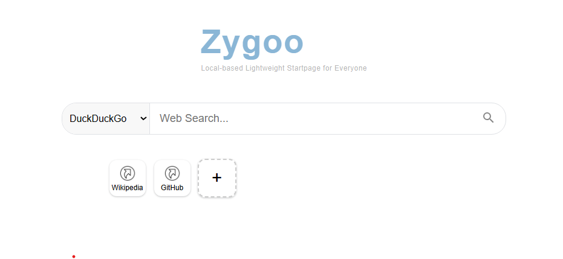

# Zygoo

ローカル実行＆カスタマイズ可能な、軽量スタートページです。

## 🔧 主な特徴

- 軽量（HTML/CSS/JS のみ）
- 検索エンジンを選べる
- ショートカットを自由に追加・並べ替え
- 全データはブラウザの LocalStorage に保存
- Import/Export 対応
- 煩わしい広告やデータマイニングなし

## 🚀 使い方

1. [公開URL](https://neustrashimy.github.io/zygoo) にアクセス
2. 検索やショートカットを自由にカスタマイズ
3. データのインポート・エクスポートでバックアップも可能

単一の HTML ファイルなので、ローカルに保存して使うことも可能です！

## 要望・バグ報告

[GitHub Issues](https://github.com/Neustrashimy/zygoo/issues)でお知らせください。